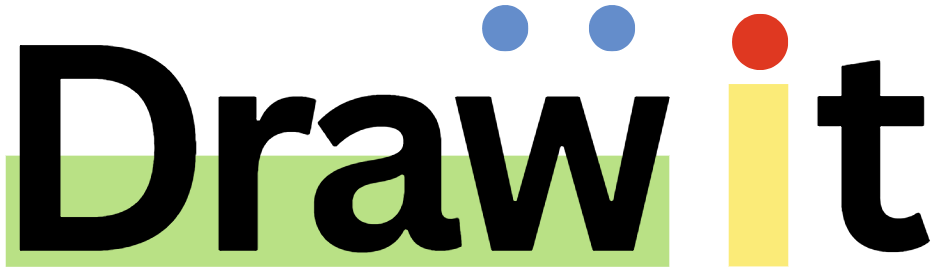

[![LinkedIn][linkedin-shield]][linkedin-url]

<!-- PROJECT LOGO -->
 

  

<h3 align="center">Drawit</h3>

  

    Drawit is an interactive whiteboard drawing app that lets users draw, erase, and customize their artwork with different pencil sizes and colors. It's designed for creative expression and offers a simple, user-friendly interface.
     
     
     
    <a href="https://drawit-online.vercel.app/">View Demo</a>
  

<!-- ABOUT THE PROJECT -->
## About The Project

[![Product Name Screen Shot][product-screenshot]](https://drawit-online.vercel.app/)

* **Drawing Tools**: Allows users to draw on the whiteboard with different pencil sizes and colors.
* **Erase**: Users can erase any part of the drawing on the canvas.
* **Simple and User-Friendly Interface**: Easy to use for everyone, from beginners to professionals.
* **HTML Canvas**: Built using HTML5 Canvas for smooth and responsive drawing functionality.

### Built With

* HTML
* CSS
* JavaScript

<!-- CONTACT -->
## Contact

Gmail - devanuragbansal@gmail.com

Project Link: [https://github.com/anuragbansall/Drawit](https://github.com/anuragbansall/Drawit)

<!-- MARKDOWN LINKS & IMAGES -->
[linkedin-shield]: https://img.shields.io/badge/-LinkedIn-black.svg?style=for-the-badge&logo=linkedin&colorB=555
[linkedin-url]: https://linkedin.com/in/anuragbansall
[product-screenshot]: ./assets/drawit-screenshot.png
